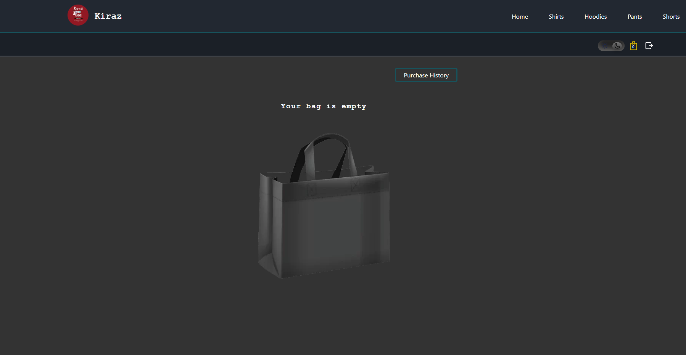

# Kiraz E-commerce Clothing site

# Frontend

I have developed a responsive E-commerce clothing site using multiple technologies.

Link: https://kiraz-clothing.netlify.app/

#### Used Technologies

- React
- TypeScript
- CSS
- Axios
- React Router

## About

#### HomePage

- There are four different collections : Shirts, Hoodies, Pants and Shorts.
- You can see the latest added product to the page.

#### Collection Pages

- You can filter products by color and size.
- You can choose multiple filtering options. (Example: filter by green color and black with large size)
- You can see each product card with its details.
- You can click on the product name or image to go to the product page.
- Admin users can add a new product card.
- Admin users can edit or delete the product card.

#### Product Page

- You can choose the color and the size of the product by the available options.
- Clicking on different color changes the img of the product to the new color.
- Whenever you choose a color or size it gets saved to the page parameter.
- Refreshing the page or sharing the url keeps the selected color and size.
- If you are logged in you can add the product to your bag.

#### User's Bag Page

- You can see the products you added to your bag.
- You can remove a product from your bag.
- You can clear your bag with one button.
- You can checkout with the chosen products.
- When you checkout , the items automatically gets moved to the history page.
- You can click on purchase history button to move to your history's page.
- I have added pagination functionality to the page.

#### History Page

- You can see the products you have bought before.
- You can see how much money you spent in total.
- I have added pagination functionality to the page.

#### More

- You have the ability to change the site's theme.
- The theme is saved in local storage.
- Navigation bar to move to a different page.
- The site is fully responsive.
- Used one generic modal for the whole site.
- You can use the search bar to search for products.

---

#### ENV File

VITE_BACKEND_URL = http://localhost:9999

---

Installation Guide:

- Clone this repository
- Type npm install in the terminal to install the dependencies
- Type npm run dev to start the client.

---

#### Showcasing my site

---

# Backend

I have developed a responsive E-commerce clothing site using multiple technologies.

Link : https://kiraz-kids.onrender.com/

#### Used Technologies

- NodeJS
- ExpressJs
- MongoDB
- Mongoose
- Cors
- Dotenv
- Json Web Token [JWT]
- BcryptJS
- Puppeteer

Used Postman to test my endpoints.

## About

I used MongoDb for my database.

#### Models

- Users
- Clothes
- Hoodies
- Pants
- Shirts
- Shorts
- BagItems
- BagHistory

Adding hoodie / pants / shirt or shorts to the database automatically adds it to the clothing collection.

#### Controllers

Each collection has its own controller file.

#### Middlewares

- Error handler middleware
- Authentication middleware

#### Constants

- Status Codes

#### Utils

- First letter capitalization
- Clothing type controller to not repeat myself for each collection

#### Scrapping

- Added scrapping logic file using puppeteer
- I scrapped from a site and got data then added it to my database
- I commented out the logic because Render doesn't accept puppeteer

#### Routes

##### All Routes

##### Users Routes

##### Clothes Routes

##### Each Collection (shorts, shirts, pants , hoodies) Routes

##### Bag Items Routes

##### Bag History Routes

---

#### ENV File

- PORT=9999
- NODE_ENV=dev
- MONGO_URI= [Your MongoDB link]
- JWT_SECRET= [Type any secret key]

---

Installation Guide:

- Clone this repository
- Type npm install in the terminal to install the dependencies
- Type npm start to start the server.
