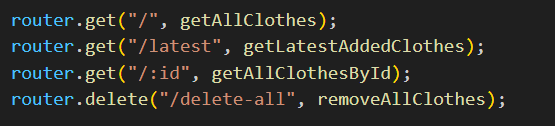
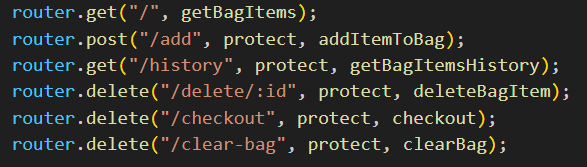

# Kiraz - Ecommerce Clothing

I have developed a responsive E-commerce clothing site using multiple technologies.

#### Used Technologies

- NodeJS
- ExpressJs
- MongoDB
- Mongoose
- Cors
- Dotenv
- Json Web Token [JWT]
- BcryptJS
- Puppeteer

Used Postman to test my endpoints.

## About

I used MongoDb for my database.

#### Models

- Users
- Clothes
- Hoodies
- Pants
- Shirts
- Shorts
- BagItems
- BagHistory

Adding hoodie / pants / shirt or shorts to the database automatically adds it to the clothing collection.

#### Controllers

Each collection has its own controller file.

#### Middlewares

- Error handler middleware
- Authentication middleware

#### Constants

- Status Codes

#### Utils

- First letter capitalization
- Clothing type controller to not repeat myself for each collection

#### Scrapping

- Added scrapping logic file using puppeteer
- I scrapped from a site and got data then added it to my database
- I commented out the logic because Render doesn't accept puppeteer

#### Routes

##### All Routes

##### Users Routes

##### Clothes Routes

##### Each Collection (shorts, shirts, pants , hoodies) Routes

##### Bag Items Routes

##### Bag History Routes

---

#### ENV File

- PORT=9999
- NODE_ENV=dev
- MONGO_URI= [Your MongoDB link]
- JWT_SECRET= [Type any secret key]

---

Installation Guide:

- Clone this repository
- Type npm install in the terminal to install the dependencies
- Type npm start to start the server.
